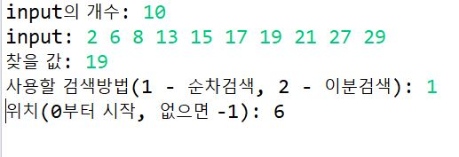
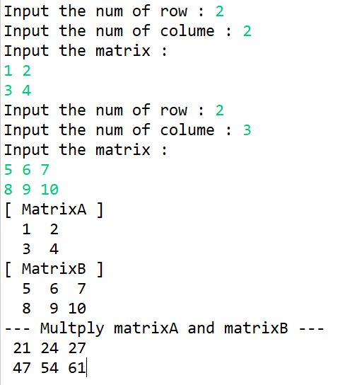
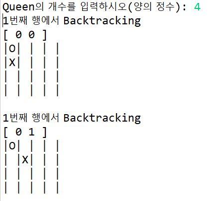
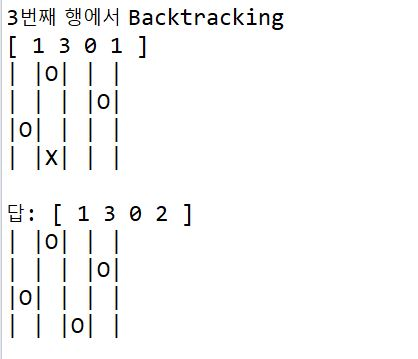

# Foundations of Algorithms
  Foundations of Algorithms 책으로 공부한 알고리즘을 JAVA로 실습하기   

## Search(검색)
### test.java

  + input개수 입력
  + input값 입력(int)
  + 찾을 값 입력
  + 검색방법 입력
  + 위치 출력

### Sequential Search(순차검색)
  + 주어진 정수배열에서 입력한 값의 위치 출력

### Binary Search(이분검색)
  + 주어진 정수배열(비내림차순 정렬)에서 입력한 값의 위치 출력
  + binSearch1: 반복
  + binSearch2: 재귀  

## Sort(정렬)
### test.java
### Exchange Sort(교환정렬)
  + 주어진 정수배열을 교환정렬

### Merge Sort(합병정렬)
  + mergesort는 함수를 호출할 때 마다 배열을 새로 할당하므로 메모리 낭비가 심함
  + 제자리정렬(in-place sort): 입력을 저장하는데 필요한 장소 이외의 추가적인 저장장소를 사용하지 않음

### Quick Sort(빠른정렬)

### Selection Sort(선택정렬)

 

## Matrix(행렬)
### Multiply Matrix(행렬곱셈)

  + 입력받은 행렬을 출력(확인용)
  + 두 행렬의 곱을 출력

 

## N-Queen
  
  

  + scanner로 퀸의 개수 입력받음
  + 퀸의 위치를 [ 0 1 2 3 ]형식으로 출력(0부터 시작)
  + 되추적이 일어날 때 마다 체스판위에 여왕말의 위치를 표시(되추적이 일어난 여왕말은 X로 나머지는 O로 표시)
  + 모든 퀸의 배치가 완료되면 체스판 위에 여왕말의 위치 표시

